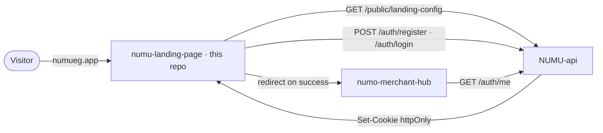
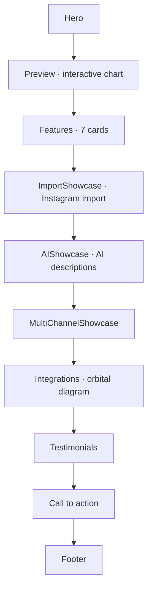
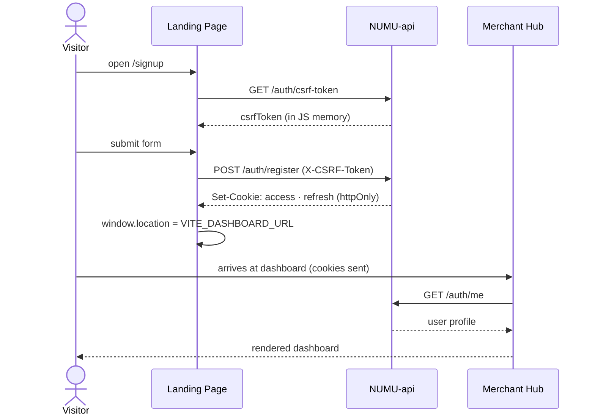
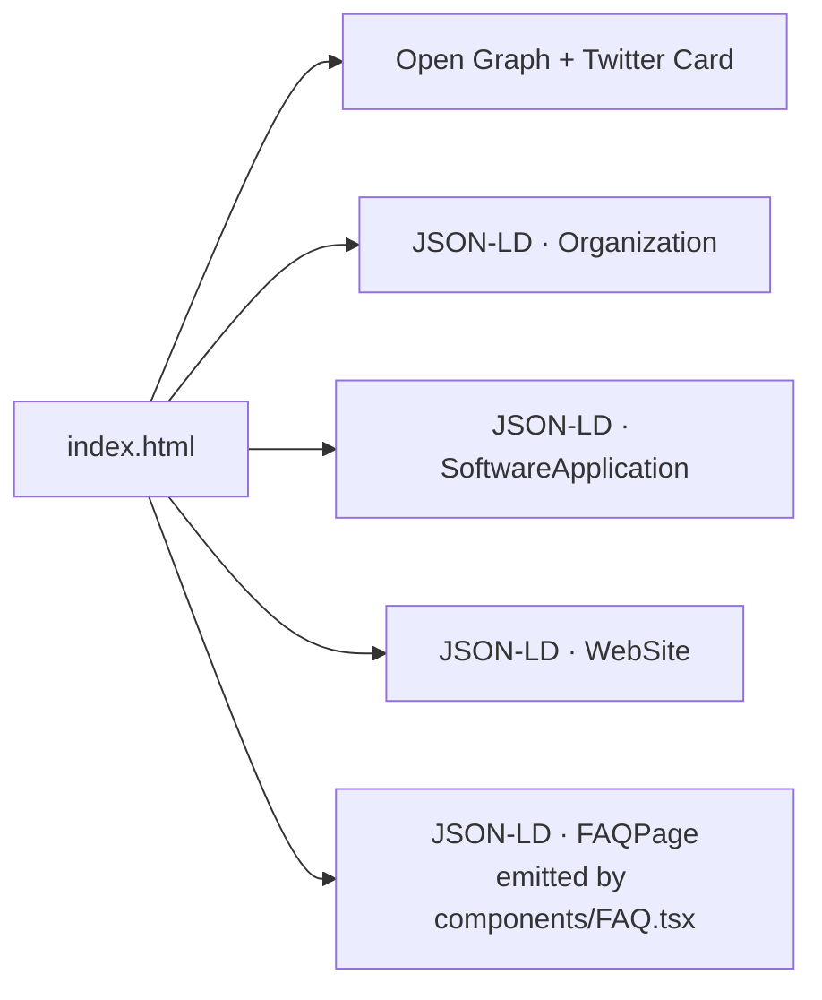

# NUMU Landing Page & Auth Gateway

The public marketing site at `numueg.app` and the **authentication gateway** for the entire NUMU ecosystem. Visitors land here, learn what NUMU does, and sign up; on success they're handed off to the merchant dashboard.

NUMU is a multi-tenant SaaS e-commerce platform purpose-built for the Egyptian and MENA market — *"Shopify for Egypt"*.

---

## Table of contents

- [System context](#system-context)
- [Tech stack](#tech-stack)
- [Page sections](#page-sections)
- [Auth handoff](#auth-handoff)
- [Project structure](#project-structure)
- [Getting started](#getting-started)
- [Environment variables](#environment-variables)
- [Design system](#design-system)
- [SEO & schema](#seo--schema)

---

## System context



This site never persists any data of its own. Section visibility is fetched at runtime from `NUMU-api` (controlled from `numu-admin`) and auth is fully delegated to the backend.

---

## Tech stack

| Layer | Choice |
|-------|--------|
| Framework | React 19 |
| Language | TypeScript 5.8 |
| Build | Vite 6 |
| Routing | react-router-dom 7 |
| Styling | Tailwind CSS 3 (PostCSS) · Lightningcss minifier — neumorphic system |
| Animation | Custom lightweight "Ballpit" physics on auth pages (Matter.js was removed) |
| Prerender | Puppeteer SSG (`npm run build:ssg`) — 8 routes + per-route JSON-LD |
| Fonts | Reem Kufi · Tajawal · Space Grotesk · JetBrains Mono |
| Package manager | npm |

---

## Page sections

The home page is a full-page snap-scroll on desktop and natural scroll on mobile. Each section renders only if `landing-config` enables it.



---

## Auth handoff



---

## Project structure

```text
numu-landing-page (1)/
├── public/                   # NUMU brand kit assets
│   ├── numu-mark-cream.webp  # Primary mark (cream paper bg)
│   ├── numu-mark-navy.webp   # Inverted mark
│   ├── favicon-cream*.png    # Cream-bg favicon set
│   ├── apple-touch-icon*.png
│   ├── llms.txt              # AI crawler hints
│   ├── robots.txt
│   └── sitemap.xml
├── src/
│   ├── components/           # Section components + UI primitives
│   ├── contexts/             # LanguageContext (en + Egyptian Arabic)
│   ├── hooks/                # useSEO · useLandingConfig · ...
│   ├── pages/                # ~21 lazy-loaded routes: Home · Login · VerifyEmail ·
│   │                         #   Waitlist · Pricing · Privacy · Terms · DataDeletion ·
│   │                         #   Contact · Refund · Apps · Themes · Developers · Learn ·
│   │                         #   Tools (+ store-names · profit-margin · invoice · ai-description)
│   ├── styles/
│   └── App.tsx
├── scripts/
│   ├── make-favicons.mjs     # Regenerates the favicon set
│   └── prerender.mjs         # Puppeteer SSG: prerenders 8 routes + injects JSON-LD
├── index.html                # Inline critical CSS · OG / Twitter / JSON-LD
└── vite.config.ts
```

---

## Getting started

```bash
# 1. Install dependencies
npm install

# 2. Configure environment
cp .env.example .env

# 3. Start the dev server (port 3090)
npm run dev

# 4. Build for production
npm run build          # SPA build
npm run build:ssg      # build + Puppeteer prerender (deploy artifact)
npm run preview
```

> The `NUMU-api` backend must be running locally (port 8000) for auth requests to resolve.

---

## Environment variables

| Variable | Description |
|----------|-------------|
| `VITE_API_URL` | NUMU-api base URL (e.g. `http://localhost:8000/api/v1`) |
| `VITE_DASHBOARD_URL` | Merchant hub URL — destination after successful auth |

---

## Design system

The landing page ships a **custom neumorphic shadow system** in Tailwind:

| Class | Use |
|-------|-----|
| `neu-flat` | Surface card at rest |
| `neu-pressed` | Pressed / active state |
| `neu-floating` | Elevated action / CTA |

Color foundation:

| Token | Hex | Use |
|-------|-----|-----|
| `background-light` | `#F5EFE6` | Cream paper ground |
| `text-main` | `#0F1624` | Navy ink |
| `accent` | brand saffron | Highlights & CTA |

Type stack: Reem Kufi (display, both scripts) · Tajawal (Arabic body) · Space Grotesk (Latin body) · JetBrains Mono (labels).

---

## SEO & schema

`index.html` ships three JSON-LD blocks at the document root:



The FAQ schema is generated from the same items array that renders the visible copy, so the schema and on-page text never drift.

Per-route overrides come from the `useSEO()` hook — each lazy-loaded page can replace `<title>`, description, canonical URL, and OG tags after JS boots.
